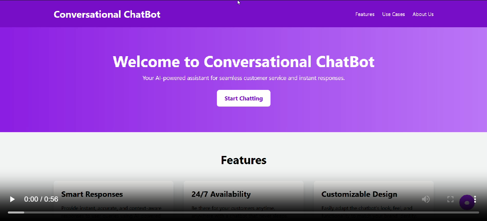

# Chat Bot
This repository contains the code for a Chat Bot project developed as part of learning Generative AI. A unique feature of this chatbot is the `CompanyInfo.js` file, which contains data about the company. The chatbot uses this data to answer questions.

## Table of Contents
- [Introduction](#introduction)
- [Installation](#installation)
- [Usage](#usage)
- [Contributing](#contributing)

## Introduction
The Chat Bot is designed to simulate conversation with human users, providing responses based on predefined rules or machine learning algorithms. This project utilizes the Gemini API to enhance the Chat Bot's capabilities. The Chat Bot React application is a web-based interface that allows users to interact with the Chat Bot.

## Installation
To install and run the Chat Bot React application, follow these steps:

1. Clone the repository:
    ```bash
    git clone https://github.com/pavan347/Customer_Service_ChatBot_Using_GenerativeAI.git
    cd Final-Year-Projects/Chat Bot
    ```

2. Install the required dependencies:
    ```bash
    npm install
    ```

3. Create a `.env` file in the root directory and add the `VITE_API_URL` key:
    ```bash
    "VITE_API_URL=your_gemini_api_url_here"
    ```

## Usage
To start the Chat Bot React application, run the following command:
```bash
npm run dev
```

## Contributing
Contributions are welcome! Please follow these steps to contribute:

1. Fork the repository.
2. Create a new branch (`git checkout -b feature-branch`).
3. Make your changes.
4. Commit your changes (`git commit -m 'Add some feature'`).
5. Push to the branch (`git push origin feature-branch`).
6. Open a pull request.

Thank you for your contributions!

## Demo

[](./public/Conversational_ChatBot_Demo.mp4)

## Contact

For any queries or if you need the project please contact [pavankumargarapati04@gmail.com](mailto:pavankumargarapati04@gmail.com).